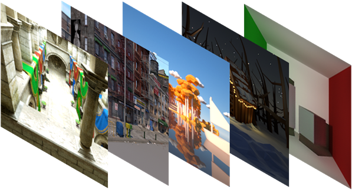
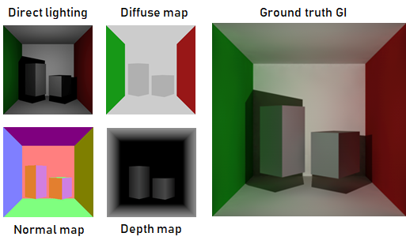

# Dataset of SRDGI

This is the dataset of SRDGI project code for the CS337 course,  containing G-buffer images and global illumination images with different rendering engines of multiple scenes. The specific usage can be referred to https://github.com/void-zxh/CS337-SRDGI.

## Downland

You can download the dataset from https://jbox.sjtu.edu.cn/l/t1cKmu.

The `dataset.zip` file is a dataset that has been classified according different image types and has four parts, while the `output.zip` file is the raw, unprocessed dataset.

